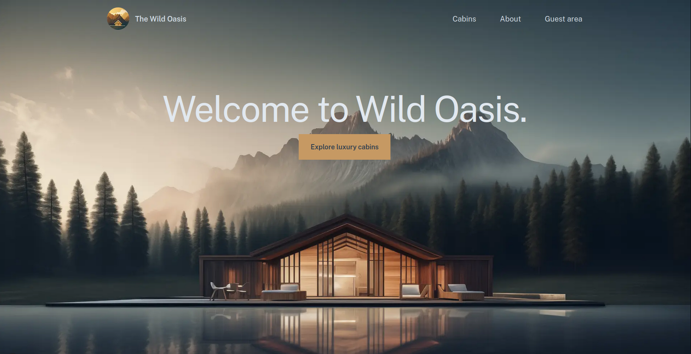

# The Wild Oasis

A cabin booking website built with Next.js that allows users to browse luxury cabins, make reservations, and manage their bookings.



## What It Does

The Wild Oasis is a full-stack web application for booking vacation cabins. Users can:

- Browse available cabins with detailed information and pricing
- View cabin availability using an interactive date picker
- Create reservations and manage bookings
- Authenticate using Google OAuth
- Update their guest profile with personal information
- View, edit, and delete their existing reservations
- Select their nationality from a country picker
- Add breakfast options to their reservations

## Tech Stack

**Frontend:**

- Next.js 16.1.1 - React framework with server components
- React 19.2.3 - UI library
- TypeScript - Type-safe JavaScript
- Tailwind CSS 4 - Utility-first CSS framework
- date-fns - Date manipulation and formatting
- react-day-picker - Date range selection component
- Sonner - Toast notifications

**Backend & Services:**

- Supabase - PostgreSQL database and authentication
- NextAuth 5.0.0-beta - Authentication and session management
- Google OAuth - Social login provider

**Development:**

- ESLint - Code linting
- PostCSS - CSS processing
- Zod - Schema validation

## Environment Variables

Create a `.env.local` file with:

```
NEXT_PUBLIC_SUPABASE_URL=your_supabase_url
NEXT_PUBLIC_SUPABASE_ANON_KEY=your_anon_key
NEXTAUTH_SECRET=your_secret
NEXTAUTH_URL=http://localhost:3000
GOOGLE_ID=your_google_oauth_id
GOOGLE_SECRET=your_google_oauth_secret
```

## Getting Started

1. Install dependencies:

```bash
npm install
```

2. Run the development server:

```bash
npm run dev
```

3. Open [http://localhost:3000](http://localhost:3000) in your browser.

## Available Scripts

- `npm run dev` - Start development server
- `npm run build` - Build for production
- `npm start` - Start production server
- `npm run lint` - Run ESLint

## Key Features

- Server-side rendering with Next.js App Router
- Real-time database queries using Supabase
- Role-based access control for protected routes
- Form validation with Zod
- Responsive design with Tailwind CSS
- Toast notifications for user feedback
- Type-safe components with TypeScript
